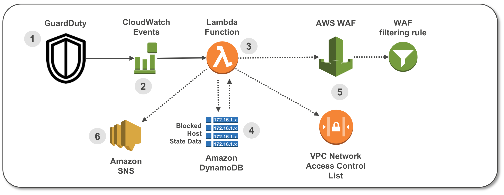

## AWS GD2ACL

### WAFv2 Notes

- You will need to have the artifacts (zip files in artifacts folder) staged on S3 and also update **ArtifactsBucket** and **ArtifactsPrefix**
- Template no longer supports an existing IP sets. Regional and CloudFront IP sets are created automatically and can be included in your existing WAF rules and ACLs
- New Regional and Global WAF ACLs can be created by changing parameter in the template from **False** to **True**
- Lambda runtime has been updated to use Arm
- Confirm expected functionality in non-production environment
- Code WAFv1 is available in the [WAFv1 branch](https://github.com/aws-samples/amazon-guardduty-waf-acl/tree/wafv1/)

---

### How to use Amazon GuardDuty and AWS Web Application Firewall to Automatically Block Suspicious Hosts

This solution uses Amazon GuardDuty to automatically update AWS Web Application Firewall Access Control Lists (WAF ACLs) and VPC Network Access Control Lists (NACLs) in response to GuardDuty findings. After GuardDuty detects a suspicious activity, the solution updates these resources to block communication from the suspicious host while additional investigation and remediation may be performed.

### Solution diagram

Here’s how the solution works, as shown in the diagram:

1.	A GuardDuty Finding is raised with suspected malicious activity.
2.	A CloudWatch Event is configured to filter for GuardDuty Finding type.
3.	A Lambda function is invoked by the CloudWatch Event and parses the GuardDuty Finding.
4.	State data for blocked hosts is stored in DynamoDB table. The Lambda function checks the state table for existing host entry.
5.	The Lambda function creates a filter in a WAF ACL and in a VPC NACL. Older entries are aged out to create a “sliding window” of blocked hosts.
6.	A notification email is sent via Amazon Simple Notification Service (SNS).

### License Summary

This sample code is made available under a modified MIT license. See the LICENSE file.
